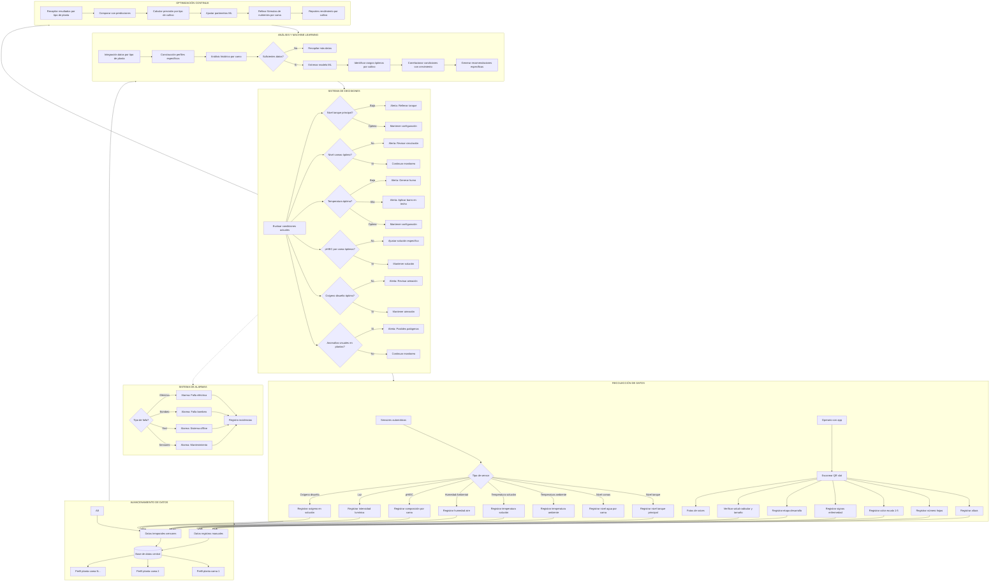

---
{"dg-publish":true,"permalink":"/diagrama-de-flujo-invernadero/","hide":true,"created":"2025-05-01T06:29","updated":"2025-05-01T18:29"}
---

```mermaid
flowchart TD
    %% SENSORES Y DATOS
    subgraph RECOLECCION["RECOLECCIÓN DE DATOS"]
        A1[Sensores automáticos] --> A2{Tipo de sensor}
        A2 -->|Nivel tanque| A3[Registrar nivel tanque principal]
        A2 -->|Nivel camas| A3b[Registrar nivel agua por cama]
        A2 -->|Temperatura ambiente| A4[Registrar temperatura ambiente]
        A2 -->|Temperatura solución| A4b[Registrar temperatura solución]
        A2 -->|Humedad Ambiental| A5[Registrar humedad aire]
        A2 -->|pH/EC| A6[Registrar composición por cama]
        A2 -->|Luz| A7[Registrar intensidad lumínica]
        A2 -->|Oxígeno disuelto| A9[Registrar oxígeno en solución]
        
        B1[Operario con app] --> B2[Escanear QR slot]
        B2 --> B3[Registrar altura]
        B2 --> B4[Registrar número hojas]
        B2 --> B5[Registrar color escala 1-5]
        B2 --> B6[Registrar signos enfermedad]
        B2 --> B7[Registrar etapa desarrollo]
        B2 --> B8[Verificar salud radicular y tamaño]
        B2 --> B8b[Fotos de raíces]
    end
    
    %% BASE DE DATOS POR TIPO DE PLANTA
    subgraph ALMACENAMIENTO["ALMACENAMIENTO DE DATOS"]
        C1[(Base de datos central)]
        A3 & A4 & A4b & A5 & A6 & A7 & A8 & A9 --> C2[Datos temporales sensores]
        B3 & B4 & B5 & B6 & B7 & B8 --> C3[Datos registros manuales]
        C2 --> C1
        C3 --> C1
        
        C4[Perfil planta cama 1]
        C5[Perfil planta cama 2]
        C6[Perfil planta cama N...]
        
        C1 --> C4 & C5 & C6
    end
    
    %% ANÁLISIS Y ML
    subgraph PROCESAMIENTO["ANÁLISIS Y MACHINE LEARNING"]
        D1[Integración datos por tipo de planta] --> D2[Construcción perfiles específicos]
        D2 --> D3[Análisis histórico por cama]
        D3 --> D4{Suficientes datos?}
        D4 -->|No| D5[Recopilar más datos]
        D4 -->|Sí| D6[Entrenar modelo ML]
        D6 --> D7[Identificar rangos óptimos por cultivo]
        D7 --> D8[Correlacionar condiciones con crecimiento]
        D8 --> D9[Generar recomendaciones específicas]
    end
    
    %% ACCIONES DEL SISTEMA
    subgraph DECISIONES["SISTEMA DE DECISIONES"]
        E1[Evaluar condiciones actuales] --> E2{Nivel tanque principal?}
        E2 -->|Bajo| E3[Alerta: Rellenar tanque]
        E2 -->|Óptimo| E4[Mantener configuración]
        
        E1 --> E2b{Nivel camas óptimo?}
        E2b -->|No| E3b[Alerta: Revisar circulación]
        E2b -->|Sí| E4b[Continuar monitoreo]
        
        E1 --> E5{Temperatura óptima?}
        E5 -->|Baja| E6[Alerta: Generar humo]
        E5 -->|Alta| E7[Alerta: Aplicar barro en techo]
        E5 -->|Óptima| E8[Mantener configuración]
        
        E1 --> E9{pH/EC por cama óptimos?}
        E9 -->|No| E10[Ajustar solución específica]
        E9 -->|Sí| E11[Mantener solución]
        
        E1 --> E15{Oxígeno disuelto óptimo?}
        E15 -->|No| E16[Alerta: Revisar aireación]
        E15 -->|Sí| E17[Mantener aireación]
        
        E1 --> E18{Anomalías visuales en plantas?}
        E18 -->|Sí| E19[Alerta: Posibles patógenos]
        E18 -->|No| E20[Continuar monitoreo]
    end
    
    %% OPTIMIZACIÓN
    subgraph OPTIMIZACION["OPTIMIZACIÓN CONTINUA"]
        F1[Recopilar resultados por tipo de planta] --> F2[Comparar con predicciones]
        F2 --> F3[Calcular precisión por tipo de cultivo]
        F3 --> F4[Ajustar parámetros ML]
        F4 --> F5[Refinar fórmulas de nutrientes por cama]
        F5 --> F6[Reportes rendimiento por cultivo]
    end
    
    %% SISTEMA DE ALARMAS
    subgraph ALARMAS["SISTEMA DE ALARMAS"]
        G1{Tipo de falla?}
        G1 -->|Eléctrica| G2[Alarma: Falla eléctrica]
        G1 -->|Bombeo| G3[Alarma: Falla bombeo]
        G1 -->|Red| G4[Alarma: Sistema offline]
        G1 -->|Sensores| G5[Alarma: Mantenimiento]
        
        G2 & G3 & G4 & G5 --> G6[Registro incidencias]
    end
    
    %% CONEXIONES ENTRE SUBGRAFOS
    RECOLECCION --> ALMACENAMIENTO
    ALMACENAMIENTO --> PROCESAMIENTO
    PROCESAMIENTO --> DECISIONES
    DECISIONES --> RECOLECCION
    DECISIONES --> OPTIMIZACION
    OPTIMIZACION --> PROCESAMIENTO
    DECISIONES -.-> ALARMAS
```
