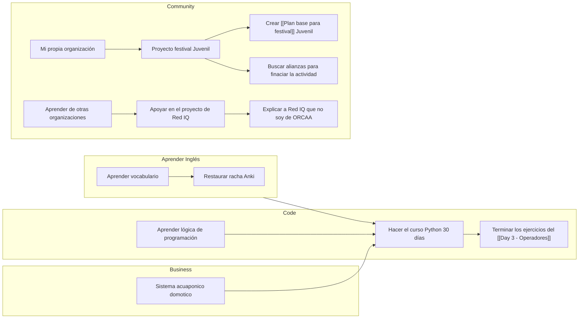

---
{"dg-publish":true,"permalink":"/me/productivity/tasks/","created":"2024-01-28T18:44","updated":"2024-07-05T17:14"}
---

## Gráfico de Goals vs Tareas

## Legend
### Tags
🔥 : cosas que solo se hacen una vez, se define en el tiempo
🚀: acciones que se van a repetir en el tiempo, se coloca en una rutina
🛒: Que se tiene que comprar
### Priority
🔺 : Que se debe hacer **hoy** 
⏫ : Que se debe hacer **mañana o pasado mañana**
🔼 : Que se debe hacer **esta semana**
Todo lo demás no tiene prioridad
[[Me/Productivity/My be goals\|My be goals]]